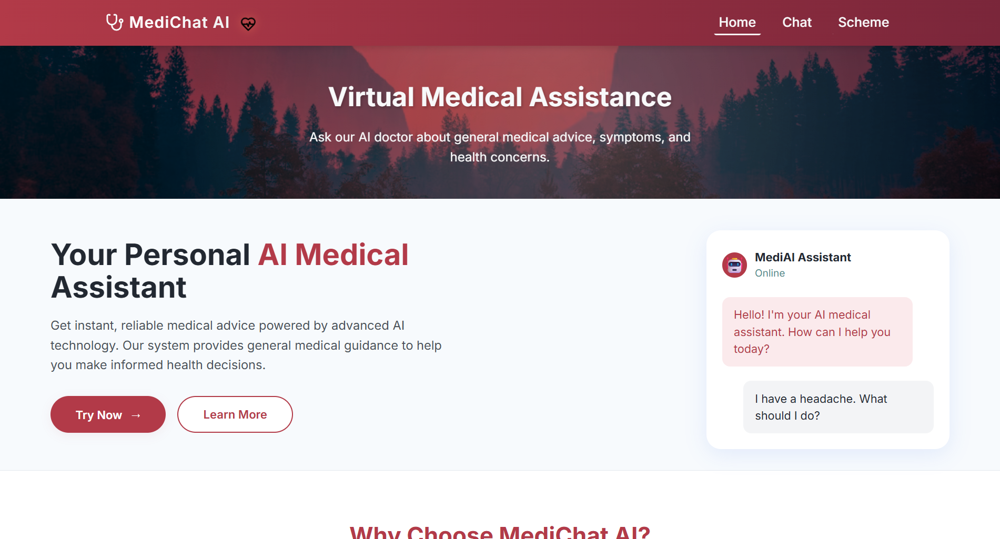
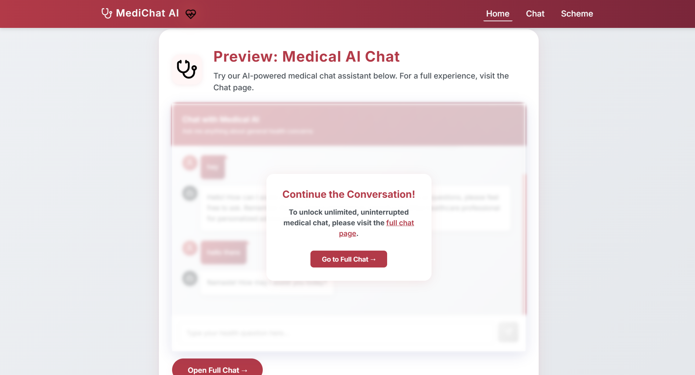
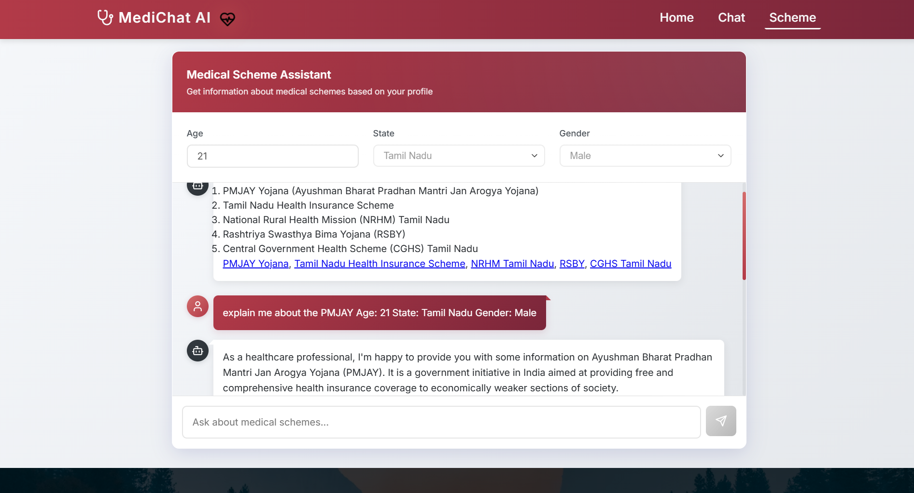

<!-- LOGO & TITLE -->
<p align="center">
  
</p>

<h1 align="center">MediChat AI</h1>
<p align="center">
  
  
  
  
</p>

<p align="center">
  <b>Your Virtual Medical Assistant - Fast, Private, and AI-Powered</b>
</p>

---

## 🚀 Features

- 🩺 <b>AI Medical Chat</b>: Get instant answers to your health questions
- 💡 <b>Health Tips</b>: Personalized wellness advice
- 🔒 <b>Privacy First</b>: Your data is never shared
- ⏰ <b>24/7 Availability</b>: Always ready to help
- 🏛️ <b>Government Schemes</b>: Discover medical schemes tailored for you
- 📄 <b>Export Chat</b>: Download your chat as PDF

---

## 🌟 Screenshots

<p align="center">
  
  
</p>
<p align="center">
  
  
</p>
<p align="center">
  
</p>

---

## 🖥️ Live Demo

> <b>Coming Soon!</b> (Run locally to try it now)

---

## 🛠️ Tech Stack

<p align="center">
  
</p>

- <b>React 18</b> + <b>TypeScript</b>
- <b>Vite</b> for blazing fast dev
- <b>Custom CSS</b> for a beautiful dark red theme
- <b>Lucide Icons</b> for modern UI

---

## 📦 Getting Started

```bash
# Clone the repo
$ git clone https://github.com/yourusername/medico.git
$ cd medico

# Install dependencies
$ npm install

# Start the app
$ npm run dev
```

---

## 🤖 AI Model

- Powered by [LM Studio](https://lmstudio.ai/) and Bio-Medical Llama 3
- <b>Note:</b> You need to run the LM Studio server locally for full AI chat functionality.

---

## 📸 More Previews

<p align="center">
  
</p>

---

## 🙏 Credits

- <b>Design & Development:</b> Your Name
- <b>Icons:</b> [Lucide Icons](https://lucide.dev/)
- <b>AI Model:</b> [LM Studio](https://lmstudio.ai/)

---

<p align="center">
  
</p>

<p align="center">
  
</p>
